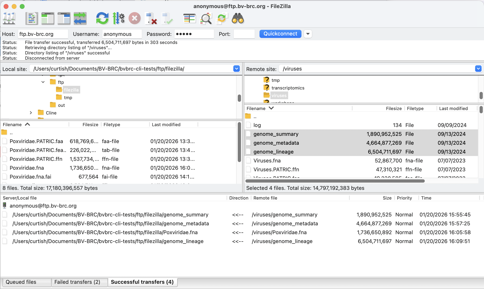

## BV-BRC FTP

https://www.bv-brc.org/docs/quick_references/ftp.html

Hand Downloaded with Filezilla
  * server: ftp.bv-brc.org
  * port: 22
  * user: anonymous
  * password: guest
  *   

  CLI Download
  * TBD
  * Command-Line Access using lftp lftp -u anonymous,guest ftp.bv-brc.org Within lftp, ensure that FTPS is enabled: set ftp:ssl-force true set ftp:ssl-protect-data true set ssl:verify-certificate no
  * curl –ssl-reqd –user anonymous:guest ftp://ftp.bv-brc.org/<path-to-file>
  * wget –ftp-user=anonymous –ftp-password=guest –secure-protocol=auto ftps://ftp.bv-brc.org/<path-to-file>